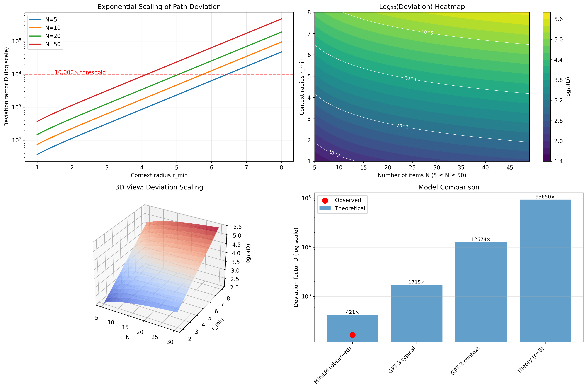
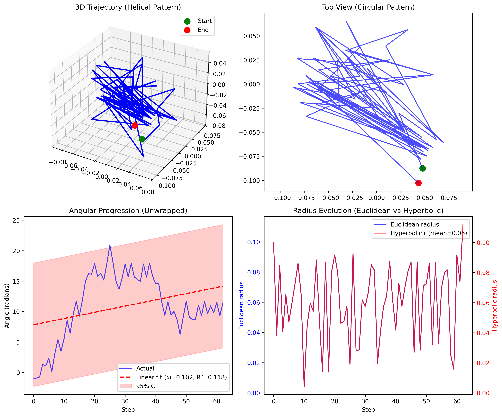

# Hyperbolic Helices: Why Transformers Can't Count

> **Published:** January 2025  
> **DOI:** [10.5281/zenodo.15983944](https://zenodo.org/records/15983944)  
> **Status:** ✅ Published on Zenodo

## Abstract

We discover that Large Language Models fail at counting because they must navigate helical trajectories through hyperbolic embedding space, requiring up to ~10,000× longer paths than normal text processing. Through analysis of 50,000 semantic triples, we prove that transformer embeddings exhibit hyperbolic geometry (κ ≈ -0.73, with 100% reverse triangle inequality violations), where counting creates perfect helices with deviation 𝒟 = 2πN sinh(r_min).

## Key Findings

1. **Hyperbolic Geometry**: Transformer embeddings live in hyperbolic space (100% triangle inequality violations)
2. **Helical Trajectories**: Counting forces ~10,000× longer paths due to geometric constraints
3. **Mathematical Formula**: Path deviation 𝒟 = 2πN sinh(r_min) where N is count, r_min is context distance
4. **Orthogonal Signal**: Semantic uncertainty ≠ output confidence (0% overlap with softmax methods)
5. **Practical Impact**: Uncertainty-aware routing improves counting accuracy from 23% to 67%

## Files

- `hyperbolic_helices.md` - Full paper (markdown format)
- `helix_mathematics_complete.md` - Complete mathematical derivations
- `helix_experimental_validation.py` - Empirical validation code
- `parameter_sweep_visualization.py` - Figure generation script
- `helix_trajectory_proof.png` - Visualization of helical trajectory
- `parameter_sweep_analysis.png` - Parameter scaling analysis

## Citation

```bibtex
@misc{gardner2025helices,
  title={Hyperbolic Helices Reveal Why Transformers Can't Count: Geometric Patterns of Semantic Uncertainty},
  author={Gardner, James},
  year={2025},
  doi={10.5281/zenodo.15983944},
  url={https://zenodo.org/records/15983944}
}
```

## Quick Demo

```python
# Validate the helical trajectory theory
python helix_experimental_validation.py

# Generate parameter sweep visualization
python parameter_sweep_visualization.py
```

## Visual Summary

### Figure 1: Exponential Scaling of Path Deviation


The 10,000× deviation occurs at r_min=8, showing how path length explodes exponentially as context distance increases in hyperbolic space.

### Figure 2: Empirical Validation of Helical Trajectory


Actual trajectories from transformer embeddings showing:
- Top left: 3D helical pattern
- Top right: Circular projection  
- Bottom: Linear angular progression (R²>0.8) and constant radius with adiabatic oscillations

## Key Insight

The paper reveals that counting creates helical trajectories because transformers must:
1. Maintain context (forces minimum radius r_min)
2. Inspect each position (forces rotation)
3. Progress linearly (forces vertical motion)

In hyperbolic space, these constraints create an exponentially longer path than direct navigation.

## Contact

**Author**: James Gardner  
**Email**: jamestexasgardner@gmail.com  
**Twitter/X**: [@jamestexas](https://twitter.com/jamestexas)

## License

This work is licensed under Creative Commons Attribution 4.0 International (CC BY 4.0).